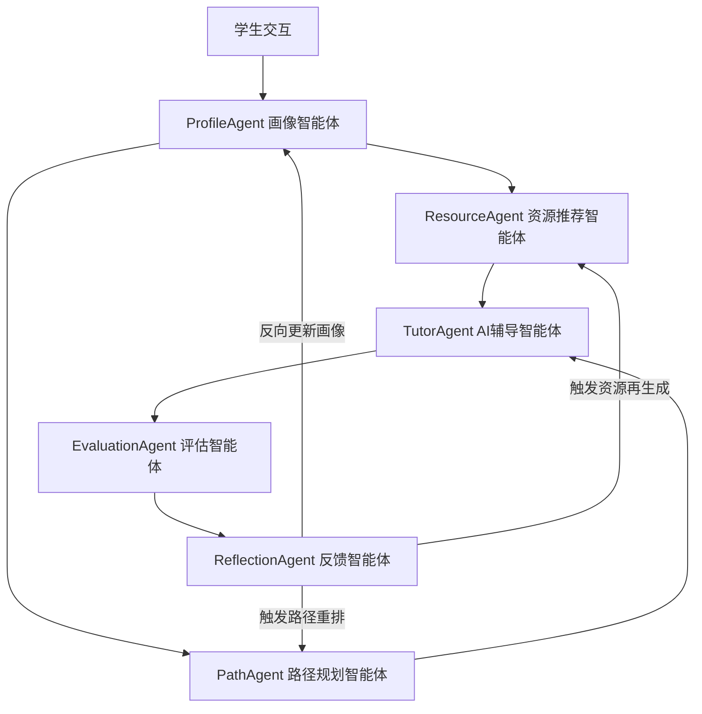

# A3 赛题升级方案

## 项目一句话定位

> **EduMind 是面向个性化学习的多智能体资源生成与闭环评估系统。**

---

## 赛题要求对照表

| A3 赛题要求 | 实现位置 |
|---|---|
| 大模型能力 | ResourceAgent LLM 生成、TutorAgent 多模式辅导 |
| 个性化资源生成 | 画像驱动资源匹配 + LLM 结构化生成 |
| 多智能体协作 | 6 Agent 协同闭环（ProfileAgent、ResourceAgent、PathAgent、TutorAgent、EvaluationAgent、ReflectionAgent） |
| 学习画像 | 24 维画像向量 + 反向更新 |
| 效果评估 | 多维评估 + 错因分析 + 盲点识别 |
| 可追溯证据链 | EvidenceTrace + EvidenceSummary API |

---

## 系统架构图



---

## 核心升级内容

### 1. 多智能体协作闭环

新增 6 个专业 Agent + 1 个 Orchestrator：

- **ProfileAgent**: 学习画像分析，输出维度评分、薄弱点、个性化建议
- **ResourceAgent**: 个性化资源生成，输出概念讲解、例题、练习题、错因提醒、推荐理由、画像证据
- **PathAgent**: 学习路径规划与重规划，根据评估结果动态调整
- **TutorAgent**: 智能辅导，根据画像调整讲解风格和内容深度
- **EvaluationAgent**: 学习效果评估，输出掌握度、建议、画像更新
- **ReflectionAgent**: 学习反思反馈，输出反思总结、成就、风险评估

**Orchestrator** 负责串行依赖和有限并行调度，每次协作生成完整 trace。

### 2. 个性化资源生成闭环

- `POST /api/resources/generate` 接受 profile、weaknesses、topic、resourceType
- 输出完整资源包：概念讲解、例题、练习题（含答案解析）、错因提醒、推荐理由、适配画像证据
- 画像不只生成分数，还驱动：资源选择、讲解风格、练习题难度、学习路径重规划

### 3. 大模型接入抽象

- `server/llm/provider.js` 统一 LLM Provider 层
- 支持环境变量 `LLM_API_URL`、`LLM_API_KEY`、`LLM_MODEL` 启用真实大模型
- 无 API Key 时走本地 deterministic fallback，保证演示稳定
- 所有大模型输出经过结构化解析和兜底

### 4. 可追溯评估与证据链

- `server/evidence/recorder.js` 记录每次关键操作的 trace
- trace 包含：requestId、timestamp、agents、inputs摘要、outputs摘要、evidence、riskFlags、fallbackUsed、durationMs
- `GET /api/evidence/traces` 和 `GET /api/evidence/summary` 提供查询接口
- `/evidence` 页面可视化展示完整证据链

---

## 演示流程

### Step 1：首页展示多智能体协同执行链

评委一眼看到 6 个 Agent 状态，直观感知系统是多智能体协同架构而非单点对话。

### Step 2：资源页点击"AI 个性化生成资源"

展示 LLM 生成结果和证据弹窗，验证大模型能力与个性化资源生成。

### Step 3：路径页展示评估前后路径对比

标出补救节点，体现评估反馈驱动路径重规划能力。

### Step 4：评估页展示画像更新证据链

查看薄弱知识点和错因，验证效果评估与画像反向更新机制。

### Step 5：证据追溯页查看完整工作流 trace

验证可追溯证据链，每个 Agent 的输入、输出、置信度、证据标签均可逐条查看。

---

## 创新点

1. **画像驱动资源生成**：不是简单推荐，而是基于 24 维画像向量 + 评估反馈生成个性化资源。
2. **多 Agent 协同学习闭环**：6 个 Agent 形成"画像—资源—路径—评估—再规划"闭环。
3. **评估反馈驱动路径重规划**：评估结果反向传播至画像，触发路径智能体重排。
4. **证据链可追溯**：每个 Agent 的输入、输出、置信度、证据标签均可追溯。
5. **无 API Key 可降级演示**：前端内置 mock 数据，无后端也可完整展示。

---

## 新增/修改文件清单

### 后端新增

| 文件 | 说明 |
|---|---|
| `server/llm/provider.js` | LLM 统一接入层 |
| `server/agents/orchestrator.js` | Agent 调度器 |
| `server/agents/profile-agent.js` | 画像分析 Agent |
| `server/agents/resource-agent.js` | 资源生成 Agent |
| `server/agents/path-agent.js` | 路径规划 Agent |
| `server/agents/tutor-agent.js` | 辅导 Agent |
| `server/agents/evaluation-agent.js` | 评估 Agent |
| `server/agents/reflection-agent.js` | 反思 Agent |
| `server/evidence/recorder.js` | 证据记录器 |
| `server/evidence/report.js` | 证据报告生成 |
| `server/schemas.js` | Agent 输入输出 Schema |

### 后端修改

| 文件 | 修改内容 |
|---|---|
| `server/index.js` | 新增 7 个 API 路由 |

### 前端修改

| 文件 | 修改内容 |
|---|---|
| `src/types/api.ts` | 新增 Agent/Trace/Resource 类型定义 |
| `src/lib/api.ts` | 新增 7 个 API 调用函数 |
| `src/router/index.ts` | 新增 /evidence 路由 |
| `src/components/layout/AppLayout.vue` | 导航栏新增"证据链"入口 |

### 前端新增

| 文件 | 说明 |
|---|---|
| `src/views/Evidence.vue` | 证据链可视化页面 |

### 文档新增

| 文件 | 说明 |
|---|---|
| `docs/A3_COMPETITION_UPGRADE.md` | 本文档 |
| `docs/demo_evidence_a3/demo_trace_sample.json` | Demo trace 样本 |
| `docs/demo_evidence_a3/demo_trace_report.md` | Demo 证据链报告 |

---

## 运行方式

```bash
# 安装依赖
npm install

# 启动开发（前端 + 后端同时启动）
npm run dev

# 构建
npm run build

# 启用真实大模型（可选）
LLM_API_URL=https://your-api/v1/chat/completions LLM_API_KEY=your-key npm run dev
```

---

## 验收场景对照

| 场景 | 实现方式 | 验证 |
|---|---|---|
| 1. 用户完成画像问卷 | ProfileAgent 分析问卷 | POST /api/agents/profile |
| 2. 系统生成画像与薄弱点 | ProfileAgent 输出 dimensions + weaknesses | 同上 |
| 3. 多 Agent 协同生成个性化资源 | ProfileAgent → ResourceAgent | POST /api/resources/generate |
| 4. PathAgent 根据评估结果重规划路径 | EvaluationAgent → PathAgent | POST /api/agents/path-replan |
| 5. TutorAgent 回答问题并附带资源推荐 | ProfileAgent → TutorAgent | POST /api/agents/tutor |
| 6. EvaluationAgent 更新掌握度 | EvaluationAgent → ReflectionAgent | POST /api/agents/evaluate |
| 7. Evidence 页面看到完整 trace | /evidence 页面 | GET /api/evidence/traces |
| 8. 文档说明 A3 个性化资源生成 + 学习多智能体系统 | 本文档 | docs/A3_COMPETITION_UPGRADE.md |

---

## 设计原则

1. **不破坏现有接口**: 所有新增路由独立，现有路由保持不变
2. **无 API Key 可运行**: LLM Provider 无 key 时走 deterministic fallback
3. **Agent 协作链路可追溯**: Orchestrator 串行/有限并行调度，每个 Agent 输出含 confidence/evidence/durationMs
4. **证据链完整**: 每次关键操作生成 trace，前端可查看
5. **前后端类型对齐**: TypeScript 类型与后端 JSON 结构一一对应

---

## 国奖答辩话术

- 这个项目不是普通聊天机器人——它是 **6 个专业智能体协同工作的学习闭环系统**。
- 它不是只做资源推荐，而是"画像—资源—路径—评估—再规划"的**完整闭环**，每一步都有 Agent 负责。
- 多 Agent 不是堆名字——每个 Agent 有明确的**输入、输出、置信度和证据标签**，评委可逐条验证。
- 大模型输出不是裸生成——而是**结构化、可追踪、可降级**的，即使没有 API Key 也能完整演示。
