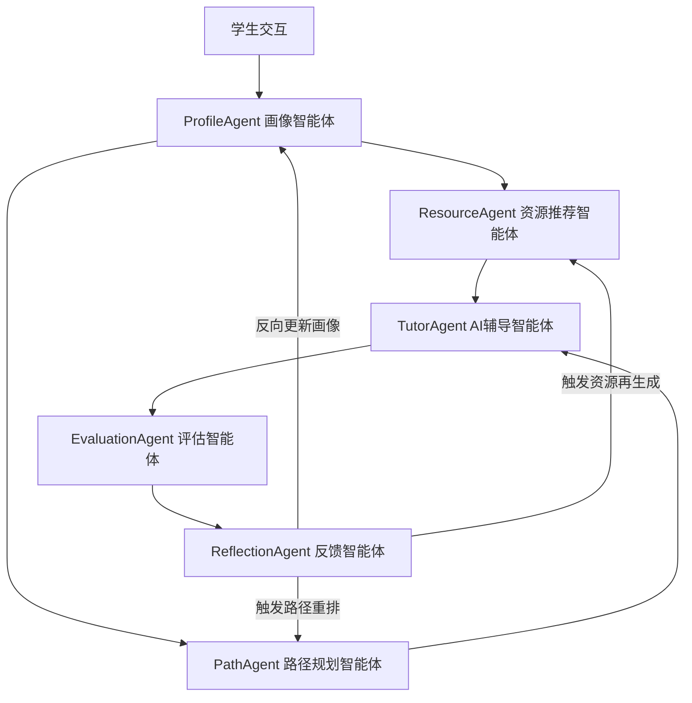

# A3 赛题升级方案

## 项目一句话定位

> **EduMind 是面向个性化学习的多智能体资源生成与闭环评估系统。**

---

## 赛题要求对照表

| A3 赛题要求 | 实现位置 |
|---|---|
| 大模型能力 | ResourceAgent LLM 生成、TutorAgent 多模式辅导 |
| 个性化资源生成 | 画像驱动资源匹配 + LLM 结构化生成 |
| 多智能体协作 | 6 Agent 协同闭环（ProfileAgent、ResourceAgent、PathAgent、TutorAgent、EvaluationAgent、ReflectionAgent） |
| 学习画像 | 24 维画像向量 + 反向更新 |
| 效果评估 | 多维评估 + 错因分析 + 盲点识别 |
| 可追溯证据链 | EvidenceTrace + EvidenceSummary API |

---

## 系统架构图

---

## 演示流程

### Step 1：首页展示多智能体协同执行链

评委一眼看到 6 个 Agent 状态，直观感知系统是多智能体协同架构而非单点对话。

### Step 2：资源页点击"AI 个性化生成资源"

展示 LLM 生成结果和证据弹窗，验证大模型能力与个性化资源生成。

### Step 3：路径页展示评估前后路径对比

标出补救节点，体现评估反馈驱动路径重规划能力。

### Step 4：评估页展示画像更新证据链

查看薄弱知识点和错因，验证效果评估与画像反向更新机制。

### Step 5：证据追溯页查看完整工作流 trace

验证可追溯证据链，每个 Agent 的输入、输出、置信度、证据标签均可逐条查看。

---

## 创新点

1. **画像驱动资源生成**：不是简单推荐，而是基于 24 维画像向量 + 评估反馈生成个性化资源。
2. **多 Agent 协同学习闭环**：6 个 Agent 形成"画像—资源—路径—评估—再规划"闭环。
3. **评估反馈驱动路径重规划**：评估结果反向传播至画像，触发路径智能体重排。
4. **证据链可追溯**：每个 Agent 的输入、输出、置信度、证据标签均可追溯。
5. **无 API Key 可降级演示**：前端内置 mock 数据，无后端也可完整展示。

---

## 国奖答辩话术

- 这个项目不是普通聊天机器人——它是 **6 个专业智能体协同工作的学习闭环系统**。
- 它不是只做资源推荐，而是"画像—资源—路径—评估—再规划"的**完整闭环**，每一步都有 Agent 负责。
- 多 Agent 不是堆名字——每个 Agent 有明确的**输入、输出、置信度和证据标签**，评委可逐条验证。
- 大模型输出不是裸生成——而是**结构化、可追踪、可降级**的，即使没有 API Key 也能完整演示。
